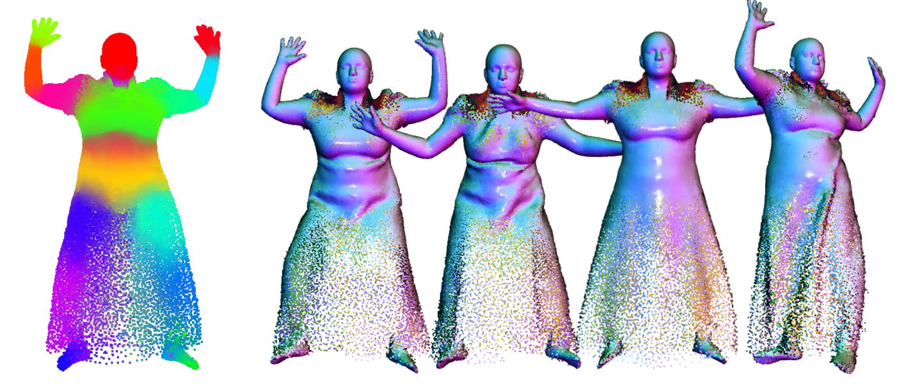

## [3DV 2022] Neural Point-based Shape Modeling of Humans in Challenging Clothing

This repository contains the official PyTorch implementation of the 3DV 2022 paper:

**Neural Point-based Shape Modeling of Humans in Challenging Clothing**  
Qianli Ma, Jinlong Yang, Michael J. Black and Siyu Tang  [Paper](https://ps.is.mpg.de/uploads_file/attachment/attachment/695/SkiRT_main_paper.pdf) | [Supp](https://ps.is.mpg.de/uploads_file/attachment/attachment/696/SkiRT_supp.pdf) | [Video]() | [Project website](https://qianlim.github.io/SkiRT.html)

## News

[Sept 14, 2022] Part of the code will include a refactored (improved) version of our previous paper, [POP (ICCV 2021)](https://github.com/qianlim/POP). The full code will be available before the end of September 2022. Stay tuned!

